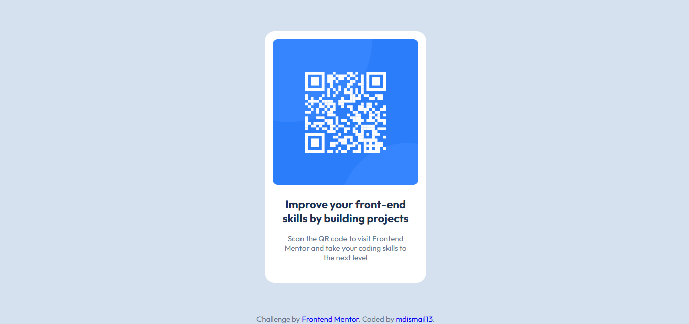

# Frontend Mentor - QR Code Component Solution
This is a solution to the [QR code component challenge on Frontend Mentor](https://www.frontendmentor.io/challenges/qr-code-component-iux_sIO_H). Frontend Mentor challenges help you improve your coding skills by building realistic projects.

## Table of contents

- [Overview](#overview)
  - [Screenshot](#screenshot)
  - [Links](#links)
- [My process](#my-process)
  - [Built with](#built-with)
  - [What I learned](#what-i-learned)
  - [Continued development](#continued-development)
  - [Useful resources](#useful-resources)
- [Author](#author)
- [Acknowledgments](#acknowledgments)

## Overview

This project is a simple QR code component that displays a scannable code linking to Frontend Mentor's website.  
It uses semantic HTML and CSS Flexbox and Grid for layout and styling.

### Screenshot



### Links

- Solution URL: [https://github.com/mdismail13/qr-code](https://github.com/mdismail13/qr-code)
- Live Site URL: [Add live site URL here](https://your-live-site-url.com)

## My process

### Built with

- Semantic HTML5 markup  
- CSS custom properties  
- Flexbox  
- CSS Grid  
- Mobile-first workflow

### What I learned

In this project, I practiced using semantic HTML and CSS Flex-box and Grid to build a clean and responsive QR code component.  
I learned how to center elements using CSS Grid and how to use Google Fonts for better typography.

Example of HTML used:

```html
<main>
  <div class="card">
    
    <h3 class="heading outfit-font">Improve your front-end skills by building projects</h3>
    <p class="description outfit-font">Scan the QR code to visit Frontend Mentor and take your coding skills to the next level</p>
  </div>
</main>
```
```css
.card {
  background-color: white;
  max-width: 320px;
  text-align: center;
  border-radius: 20px;
  display: flex;
  flex-direction: column;
}
```

### Continued development
I want to improve my skills in CSS animations and transitions to make components more interactive.
Also, I plan to learn more about accessibility features to make my projects more user-friendly.

### Useful resources

- [Frontend Mentor](https://www.frontendmentor.io/) - For project challenges and learning by doing.  
- [CSS-Tricks Flexbox Guide](https://css-tricks.com/snippets/css/a-guide-to-flexbox/) - Helped me understand flexbox layout.  
- [Google Fonts](https://fonts.google.com/) - For beautiful, free web fonts.

## Author

- Name - Md. Ismail
- Frontend Mentor - [@mdismail13](https://www.frontendmentor.io/profile/mdismail13)
- GitHub - [mdismail13](https://github.com/mdismail13)
- Facebook - [ismail.h.emon](https://www.facebook.com/ismail.h.emon/)

## Acknowledgments
Thanks to Frontend Mentor and the community for helping me improve my frontend development skills.